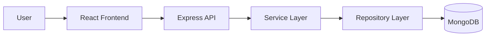

# EliteA Todos App

EliteA Todos App is a production-style template repository for a task management platform that demonstrates enterprise development practices while remaining compact enough for AI-assisted analysis.
Application Name: to-dos
## Project Overview

This repository provides a small but realistic full-stack application template with:
- a Node.js + Express backend with layered architecture
- a React frontend with reusable components and hooks
- Docker, CI/CD, logging, environment configuration, and test scaffolding

## Features

- Create, edit, delete, and complete todos
- Search and filter todos
- Pagination support is scaffolded for future expansion
- Due dates, priorities, and categories are modeled in the backend domain layer
- API versioning under /api/v1
- Structured logging with Winston
- Environment-driven configuration

## Technology Stack

### Frontend
- React 19
- JavaScript
- Axios
- React Router
- React Testing Library
- Jest

### Backend
- Node.js
- Express
- MongoDB
- Mongoose
- Winston
- Helmet
- Morgan
- Joi
- dotenv

## Architecture Diagram



## Folder Structure

```text
elitea-todos-app/
├── README.md
├── package.json
├── docker-compose.yml
├── .env
├── .env.dev
├── .env.test
├── .env.uat
├── .env.prod
├── frontend/
├── backend/
├── docs/
├── scripts/
├── .github/workflows/
├── postman/
└── sonar-project.properties
```

## Prerequisites

- Node.js 20+
- npm 10+
- Docker Desktop (optional)
- MongoDB (or Docker Compose)

## Installation

```bash
npm install
npm --prefix backend install
npm --prefix frontend install
```

## Environment Configuration

The repository includes environment templates for development, test, UAT, and production:
- .env
- .env.dev
- .env.test
- .env.uat
- .env.prod

## Running Backend

```bash
npm --prefix backend run dev
```

## Running Frontend

```bash
npm --prefix frontend run dev
```

## Running MongoDB

```bash
docker compose up -d mongo
```

## Available Scripts

```bash
npm run start
npm run dev
npm run lint
npm run test
npm run test:backend
npm run test:frontend
npm run test:integration
npm run coverage
npm run build
```

## API Endpoints

- GET /api/v1/todos
- GET /api/v1/todos/:id
- POST /api/v1/todos
- PUT /api/v1/todos/:id
- PATCH /api/v1/todos/:id/complete
- DELETE /api/v1/todos/:id
- GET /health

## Testing

### Unit Tests
- Backend service tests in backend/tests

### Integration Tests
- Route-level integration tests with Supertest in backend/tests/integration

### UI Tests
- UI test scaffolding is prepared for Playwright expansion

## Code Coverage

Run coverage with:

```bash
npm run coverage
```

Coverage output is generated under the coverage directory.

## Logging

Logs are emitted to:
- logs/application.log
- logs/error.log

Each HTTP request is logged with request/response context and timing information through the middleware stack.

## CI/CD Pipeline

GitHub Actions workflows are scaffolded under .github/workflows:
- ci.yml (planned)
- code-quality.yml
- unit-tests.yml
- release.yml

## Docker Support

The repository provides a MongoDB container through Docker Compose.

## Troubleshooting

- If MongoDB is unavailable, the backend logs a warning and continues in its structured fallback path.
- If the frontend cannot reach the API, verify that the backend is running on port 5000.
- If Docker Compose is not available, start MongoDB manually and update the MONGO_URI value in the environment file.

## Future Enhancements

- Add authentication and authorization
- Introduce pagination and filtering in the API layer
- Add full Playwright UI tests
- Add Swagger/OpenAPI documentation
- Add containerized frontend and backend services
